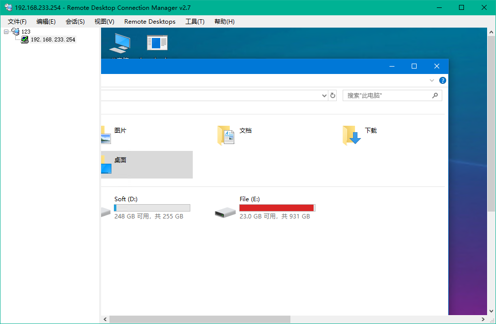

# RDCMan-zh_CN
Remote Desktop Connection Manager(RDCMan) v2.7 简体中文汉化版

### 功能

Remote Desktop Connection Manager(RDCMan)是微软官方出的一款远程桌面管理软件。[官方下载地址](https://www.microsoft.com/en-us/download/details.aspx?id=44989)

我只想简单地进行多个节点的Win主机管理，自带的远程连接只能一个一个连，很不方便。Devolutions Remote Desktop Manager最强大，但太重了，自己的需求仅仅是远程连一下。Terminals、Multidesk、mRemoteNG简洁轻巧，不过界面太丑，忘了哪一个还会抛异常奔溃，不适合长时间使用。RD Tabs倒还不错，不过布局不是自己喜欢的。比较让我满意的是Remote Desktop Organizer，简洁小巧，自己想要的功能基本都有，我本来打算就使用它了，可惜以它的一个功能令我不满意，就是不能把自己的窗口大小固定为和远程桌面的分辨率一致，对于有强迫症的我来说，真捉急，不小心鼠标点到边框就拖大、拖小或者缩放了，用着不爽。体验了这么多远程桌面管理软件，最终选择了RDCMan。

RDCMan的界面其实也没几个英文，用顺手了都不在意了。不过正是因为没几个英文，所以有汉化的冲动，微软已经几年不更新这个小工具，估计最终版就是2.7吧，那就在此基础上开刀，C#反编译，汉化，再编译，没啥技术含量。

虽然文字不多，汉化还是蛮累的。

### 截图

### 更新日志

#### 2018-12-08 v0.1

* 菜单栏汉化。
